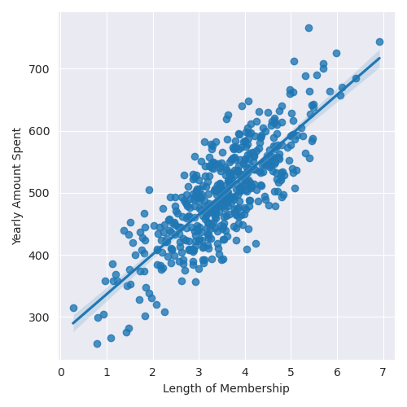

# Using Linear Regression on Ecommerce Data to Predict Yearly Amount Spent by Customers

**Retrieving the Data**

We will work with the Ecommerce Customers csv file stored within this repository. Keep in mind, this is just an artificially generated data set. The csv file has the following numerical value columns:
- Avg. Session Length: Average Session of in-store stule advice sessions.
- Time on App: Average time spent on App in Minutes
- TIme on Website: Average time spent on Website in minutes 
- Length of Membership: How many years the customer has been a member.

### Read in csv files and assign to variable named "customers"
````python
customers = pd.read_csv('Ecommerce Customers')
````

### Check the head of customers, and check out its info() and describe() methods.

````python
customers.head()
customers.info()
customers.describe()
````
````
                           Email  ... Yearly Amount Spent
0      mstephenson@fernandez.com  ...          587.951054
1              hduke@hotmail.com  ...          392.204933
2               pallen@yahoo.com  ...          487.547505
3        riverarebecca@gmail.com  ...          581.852344
4  mstephens@davidson-herman.com  ...          599.406092
````

````
[5 rows x 8 columns]
<class 'pandas.core.frame.DataFrame'>
RangeIndex: 500 entries, 0 to 499
Data columns (total 8 columns):
 #   Column                Non-Null Count  Dtype  
---  ------                --------------  -----  
 0   Email                 500 non-null    object 
 1   Address               500 non-null    object 
 2   Avatar                500 non-null    object 
 3   Avg. Session Length   500 non-null    float64
 4   Time on App           500 non-null    float64
 5   Time on Website       500 non-null    float64
 6   Length of Membership  500 non-null    float64
 7   Yearly Amount Spent   500 non-null    float64
dtypes: float64(5), object(3)
memory usage: 31.4+ KB
None
````

````
       Avg. Session Length  Time on App  ...  Length of Membership  Yearly Amount Spent
count           500.000000   500.000000  ...            500.000000           500.000000
mean             33.053194    12.052488  ...              3.533462           499.314038
std               0.992563     0.994216  ...              0.999278            79.314782
min              29.532429     8.508152  ...              0.269901           256.670582
25%              32.341822    11.388153  ...              2.930450           445.038277
50%              33.082008    11.983231  ...              3.533975           498.887875
75%              33.711985    12.753850  ...              4.126502           549.313828
max              36.139662    15.126994  ...              6.922689           765.518462

[8 rows x 5 columns]

````

## Exploratory Data Analysis

For the rest of the project, we will be only using the numerical data of the csv file.

**Use seaborn to create a jointplot to comopare the Time on Website and Yearly Amount Spent columns. Does the correlation make sense?**
````python
sns.jointplot(
        data = customers, 
        x  = customers['Time on Website'],
        y = customers['Yearly Amount Spent']
        )
````


As we can see, there doesn't seem to be much correlation between these two columns in the dataframe.


**Do the same for Time on App**

````python
sns.jointplot(
        data = customers,
        x = customers['Time on App'],
        y = customers['Yearly Amount Spent']
        )
````


On this plot, we can see a tiny bit more correlated between increased time on app and yearly amount spent.

**Let's visualize this relationship on a 2D hex bin.**

````python
sns.jointplot(
        data = customers,
        kind = 'hex' ,
        x = customers['Time on App'],
        y = customers['Length of Membership']
        )
````


Now, let's explore the types of relationships across the entire data set. We will plot this using a pairplot from seaborn.

````python
sns.pairplot(
        data = customers
        )
````


We can see that the plot with the highest correlation is the plot comparing the Length of Membership and Yearly Amount Spent.

**We can create a linear model plot based on this relationship using seaborn's `lmplot`**

````python
sns.lmplot(
        data = customers, 
        x = 'Length of Membership',
        y = 'Yearly Amount Spent'
        )
````



## Training and Testing Data 

Our exploration of the data has revealed some insights into the relationships between certain data. Let us go ahead and split the data into training and testing sets so we can try and make some predictions. We will do so on the numerical data only.

A quick look into our `customers.columns` gives us 
````
Index(['Email', 'Address', 'Avatar', 'Avg. Session Length', 'Time on App',
       'Time on Website', 'Length of Membership', 'Yearly Amount Spent'],
      dtype='object')
````

````python
X = customers[[
    'Avg. Session Length', 
    'Time on App', 
    'Time on Website', 
    'Length of Membership', 
     ]] # data we want to train our model on

y = customers['Yearly Amount Spent'] # what we want our model to predict
````

**Now we will use the `cross_validation.train_test_split` from sklearn to split the data into training and testing sets.**

````python
from sklearn.model_selection import train_test_split

X_train, X_test, y_train, y_test = train_test_split(X,y, test_size = 0.3, random_state = 101)
````

## Training the Model

````python
from sklearn.linear_model import LinearRegression

lm = LinearRegression()

lm.fit(X_train, y_train)
````

## Print the Coefficients of the Model

````python
print(lm.coef_) 
````

## Predicting Test Data

Now, let us evaluate the performance by prediciting off the test values.

````python
predictions = lm.predict(X_test)
````

**Now we will create a scatterplot of the real test values versus the predicted values.**
````python
plt.scatter(y_test, predictions)
plt.xlabel('Y test')
plt.ylabel('Predicted Y')
````


## Evaluating Performance of Model

We can do this by calculating the **Mean Absolute Error, Mean Squared Error, and the Root Mean Squared Erro**
````python
from sklearn import metrics
````
We can store these calculations in a list. Let's name this list `evalResults`:
````python
evalResults = [
        'MAE: ' + str(metrics.mean_absolute_error(y_test, predictions)),
        'MSE: ' + str(metrics.mean_squared_error(y_test, predictions)),
        'RMSE: ' + str(np.sqrt(metrics.mean_squared_error(y_test, predictions)))
        ] 

for item in evalResults:
    print(item, end = '\n')
````
This prints the following calculations for each type error:
````
MAE: 7.228148653430834
MSE: 79.81305165097443
RMSE: 8.933815066978633
````

### Residuals

Let's visualize our results using a histplot

````python
sns.distplot((y_test = predictions), kde = True , bins = 50)
plt.show()
````


### Dataframe of Coefficients

````python
coeff_customers = pd.DataFrame(lm.coef_ , X.columns, columns = ['Coefficient'])
````
returns the following dataframe
````
                      Coefficient
Avg. Session Length     25.981550
Time on App             38.590159
Time on Website          0.190405
Length of Membership    61.279097
````
### Interpret the Coefficients

For each category in the table above represents the value of the coefficient per 1 unit increase assuming we hold all other features constant/fixed.

### Should the company focus more on their mobile app or on their website.

Further tests on the relationship between the time on mobile app or website and the length of membership should be performed before making a conclusion on which platform to focus more on.

